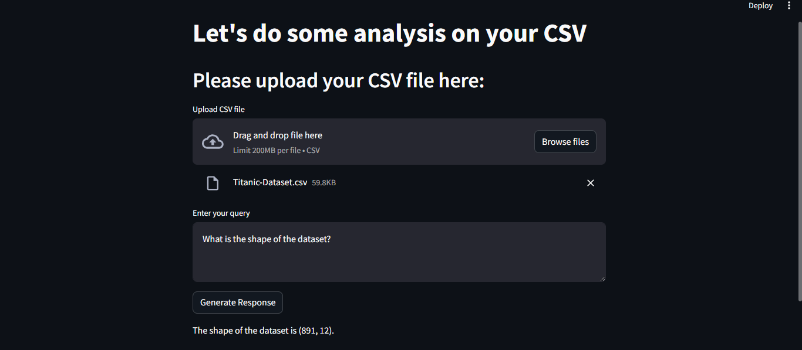

# Data Analyst Assistant

## Overview

Welcome to Data Analyst Assistant - a sophisticated Data Analyst Assistant designed to streamline your data analysis tasks effortlessly. Leveraging state-of-the-art technologies, this project combines the power of Hugging Face's LLM ("HuggingFaceH4/zephyr-7b-alpha"), Langchain Agents' "create_pandas_dataframe_agent," and the user-friendly Streamlit framework.

## Features

- **Seamless Data Upload**: Effortlessly upload your CSV files to initiate the analysis.
- **Natural Language Queries**: Communicate with the assistant using natural language for diverse data-related questions.
- **Automated Calculations**: The assistant performs complex data calculations behind the scenes.
- **Human-Friendly Results**: Receive results in clear, understandable human language.

## Why Data Analyst Assistant?

Data analysis shouldn't be a challenge, and [Your Project Name] aims to make it accessible to all levels of expertise. Whether you are an experienced data professional or a beginner, this tool simplifies the process, making your analyses more insightful.

## Bonus: Enhance with OpenAI LLM

For an even more robust experience, consider integrating a powerful LLM, such as OpenAI's. The flexibility and sophistication of models like OpenAI's LLM can elevate your data analysis to new heights.

## Getting Started

1. **Clone the Repository:**
   ```bash
   git clone https://github.com/jamal022/Data-Analyst-Assistant.git
   cd Data-Analyst-Assistant
2. **Install Dependencies:**
   ```bash
   pip install -r requirements.txt
3. **Set up your API Key:**
Create a .env file in the root directory of the project and include your API key. This file should look like:
   ```bash
   HUGGINGFACEHUB_API_TOKEN=""
5. **Run the Application:**
   ```bash
   streamlit run app.py
   
